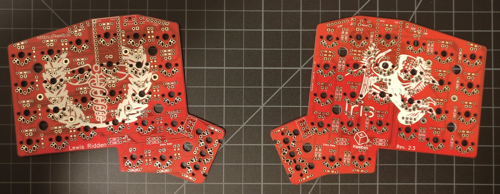

# RGB Iris Build Guide

## Disclaimer
My electronics knowledge is limited to soldering a Planck, Let's Split, and a few $10 soldering kits from Amazon.  My design comes from Googling, testing, and viewing examples over a period of a couple months.  I have no theoretical knowledge in electrical engineering.  I completely disregarded things like trace width of the power rails on the PCB.  That said, this guide is for informational purposes only.  If you attempt to reproduce any of my results, it is at your own risk.

## Parts
### Keyboard
| QTY | Part                  | Part Number                         | Source                                                                          | Cost                                 | Notes                                                           |
| --- |-----------------------|-------------------------------------|---------------------------------------------------------------------------------|--------------------------------------|-----------------------------------------------------------------|
| 2   | PCB                   | KLP Prototype Red rev2.3            | https://keeb.io/                                                                | $20/pair                             | Special request.                                                | 
| 56  | SMD Diodes            | ???                                 | https://keeb.io/                                                                | Comes with PCB                       | Must request SMD when ordering.                                 |
| 2   | TRRS Jacks            | ???                                 | https://keeb.io/                                                                | Comes with PCB                       |                                                                 |
| 2   | 4.7kΩ Resistors       | ???                                 | https://keeb.io/                                                                | Comes with PCB                       |                                                                 |
| 2   | Push Buttons          | ???                                 | https://keeb.io/                                                                | Comes with PCB                       |                                                                 |
| 1   | TRRS Cable            | Any                                 | https://keeb.io/, ebay, Amazon, aliexpress, etc                                 | $1-$10 each                          |                                                                 | 
| 56  | Backlight LEDs        | Nano 2427 NeoPixels                 | https://www.adafruit.com/product/3484                                           | $5 per 10 LEDs                       | 4 pin LED that fits in KLP switch housing.                      |
| 18  | Underglow LEDs        | SK6812 Mini 3535                    | ebay                                                                            | $9 per 50 LEDs                       | Cheaper than the nanos.                                         |
| ~112| 0 Ohm Resistor        | 1206 SMD 0 Ohm Resistor             | ebay                                                                            | $1 per 100                           | Used as a jumper, jumper wire also works.                       | 
| ~40 | 0.1uF Capacitor       | 1206 SMD 0.1uF Capacitor            | ebay                                                                            | $6 per 100                           | One per single LED.                                             |
| ~18 | 1uF Capacitor         | 1206 SMD 1uF Capacitor              | ebay                                                                            | $6 per 100                           | One per LED cluster.                                            |
| 112 | Tin-Lead Holtites     | 8134-HC-8P3                         | https://mehkee.com/products/holtite-sockets-for-switches                        | $13 per 50                           | Only fits the KLP holes, not MX/ALPs.  Two per switch.          | 
| 56  | Switches              | Kailh Low Profile Switches          | https://www.novelkeys.xyz                                                       | $3.50 per 10                         | Regular or heavies.  I have Brown and Burnt Orange.             |
| 56  | Key Caps              | Kailh Low Profile Keycaps           | https://www.novelkeys.xyz                                                       | $3 per 10 Blanks / $30 for Legends   | Have not found any other compatible keycaps.                    |
| 2   | Pro Micro             | Black or Blue Pro Micro Clone       | https://keeb.io/, ebay, Amazon, aliexpress, etc                                 | $3-10 each                           | Pro Micros will be socketed.                                    |
| 4   | 12x1 LP SIP Sockets   | HWS6302 (low profile)               | http://www.king-cart.com/cgi-bin/cart.cgi?store=phoenixent&product_name=HWS2208 | $1.50 each + $10 S/H                 | Can order from Digikey or buy longer and cut to save.           |
| 48  | Through-Hole LED Legs | Any LEDs work                       | ebay                                                                            | $1-2 per 50                          | Fit best in the king cart SIP sockets.                          |
| 1   | Spool of Magnet Wire  | 30 AWG Insulated Magnet Wire        | ebay / Amazon                                                                   | $10 per spool                        | Hear there is stuff where insulation acts as flux. Mine didn't. |
| ~100 | Solder Mask Dots     | Kapton Dots 1/8" Diameter           | https://gokimco.com/kimco-at00125-kapton-dots-1-8-diameter-2000-per-roll.html   | $25 per 2000                         | The ones rated for 260 degree C.                                | 

### Case
| QTY | Part                              | Part Number                                | Source                                        | Cost                                 | Notes                                                                |
| --- |-----------------------------------|--------------------------------------------|-----------------------------------------------|--------------------------------------|----------------------------------------------------------------------|
| 2   | Black 3mm Acrylic Switch Plate    | https://github.com/keebio/iris-case/       | Sculpteo                                      | $22                                  |                                                                      |
| 4   | Black 3mm Acrylic Mid Layer       | https://github.com/keebio/iris-case/       | Sculpteo                                      | $28                                  |                                                                      |
| 2   | LED Diffuse 3mm Acrylic Mid Plate | https://github.com/keebio/iris-case/       | Sculpteo                                      | $16                                  |                                                                      |
| 2   | Black 3mm Acrylic Bottom Plate    | https://github.com/keebio/iris-case/       | Sculpteo                                      | $15                                  |                                                                      |
| ~20 | Black Silicon Feet                | 2.5 mm 3M Bumpons                          | ebay                                          | $2 per 100                           |                                                                      |
| ~30 | 9mm M2 Standoff                   |                                            | https://keeb.io/, ebay                        | $5-$20 per 100                       |                                                                      |
| ~30 | Black Low Profile M2 Screws       | M2x6mm OEM Wafer Head Laptop Machine Screw | http://www.laptopscrews.com/M2x6.htm          | $8 per 30 + $5 S/H                   | First <1mm head thickness for switch plate found.                    |
| ~30 | Black Low Profile M2 Screws       | M2x6mm Hex Socket Button Head              | https://www.ebay.com/itm/162516834614         | $4 per 50                            | First <2.5mm head thickness for bottom plate found to clear bumpons. |

## Tools
I tried to be as inclusive as possible.  It is very possible I grabbed some tool I had on hand during the build process and forgot to document it here.  Feel free to submit an issue with any questions.
| Part                              | Part Number                                | Source                                        | Cost                                  | Notes                                                                |
|-----------------------------------|--------------------------------------------|-----------------------------------------------|---------------------------------------|----------------------------------------------------------------------|
| Soldering Iron                    | Hakko FX888D                               | Amazon                                        | $90 - $140 (depending on accessories) |                                                                      |
| Chisel Tip                        | ???                                        | Amazon                                        | Came with Iron                        |                                                                      |
| Conical Tip?                      | ???                                        | Amazon                                        | Came with Iron                        | Any fine tip for the ridiculously small data pads on the 2427 LEDs.  |
| Spool of Solder Wire              | 63/37 Kester 44 Rosin Core Solder          | Amazon                                        | $30-40 per spool                      | I used 0.02" that I had on hand.                                     |
| Hot-Air Rework Station            | Hot-Air Rework Station - 303D              | https://www.sparkfun.com/products/14557       | $115                                  | For SMD soldering.                                                   | 
| Solder Paste                      | 63/37 No Clean Leaded Solder Paste         | Amazon                                        | $18 per 1.2 oz                        | Double bagged in glass jar in fridge labeled toxic all over.         |
| Small Gauge Luer Lock Tip         | 23 GAUGE 1/2"                              | ebay                                          | $14 per 50                            | Restricts flow of solder paste for precision. 22-24 gauge I think is okay.|
| Flux Pen                          | SRA #99-20 Rosin RMA Soldering Flux Pen    | Amazon                                        | $9                                    |                                                                      |
| Bottle of Isopropyl Alcohol       | 99.9% Isopropyl Alcohol                    | Amazon                                        | $13                                   |                                                                      |
| ESD Brush                         | Any Anti Static ESD Brush                  | Amazon                                        | $6 per pack of 5                      | For cleaning flux residue.                                           |
| Heat Resistant Tweezers           | Ceramic Heat Resistant Precision Tweezers  | Amazon                                        | $10                                   | Used for eCig coils.  Holds parts while soldering / reworking.       |
| Precision Tweezers                | Any Pack of Anti-static ESD Tweezers with Various Tips | Amazon                            | $11                                   | Can probably go without, but had on hand, and different tips are nice.|
| O-Ring                            | ???                                        | Amazon, any keyboard store                    | $5-10?                                | Had on hand.  Holds tweezers shut.                                   |
| Kapton Heat Resistant Tape        | Heat Resistant Kapton Tape                 | Amazon                                        | $5-10 per roll                        | Temp Solder Masking / Taping Traces to PCB.                          |
| USB Power Meter                   | Soondar Power Meter                        | Amazon                                        | $10                                   | To measure LED current.  Make sure to get one that supports data.    |
| Box of KimWipes                   | Box of KimWipes                            | Amazon                                        | $6.50 per box                         | Clean up rosin residue.                                              |
| X-ACTO Knife                      | X-ACTO #1 Knife, Z Series With Safety Cap  | Amazon                                        | $6                                    | General cutting.                                                     |
| Flush Cutters                     | Hakko CHP-170                              | Amazon                                        | $5                                    |                                                                      |
| Cutting Mat                       | Alvin Professional Self-Healing Cutting Mat| Amazon                                        | $9                                    |                                                                      |
| Solder Mat                        | BTSHOW Silicone Soldering Mat              | Amazon                                        | $11                                   |                                                                      |
| Circuit Board Holder              | Aven 17010 Adjustable Circuit Board Holder | Amazon                                        | $12                                   | Kind of cheap but it works.                                          |
| Magnifier                         | SE MH1047L Illuminated Multi-Power LED Head Magnifier| Amazon                              | $9                                    |                                                                      |
| Helping Hands / Magnifier         | Any                                        | Amazon                                        | $8-10                                 |                                                                      | 
| Precision Screw Driver Set        | Any                                        | Amazon                                        | $20                                   |                                                                      |
| Multimeter                        | Any                                        | Amazon                                        | $15-25+                               |                                                                      |
| Solder Mask Pen                   | MG Chemicals Overcoat Pen                  | Amazon                                        | $13                                   | Could probably go without.  I bought before finding the masking dots.|
| Wire Cutters / Strippers          | Any                                        | Amazon                                        | $5-30+                                |                                                                      |
| Solder Wick                       | Braided Copper Solder Wick                 | Amazon                                        | $6 per roll                           | Solder Sucker / Vacuum / Pump also works.                            |

## Guide
### Bare PCB
Here is a photo of the bare PCBs before starting any work.  I apologize for the potato quality, I only have a cell phone for a camera and not so great lighting.

### Mount the Diodes

Replace the tip that came with the solder paste with a smaller gauge one and apply to the underside of each PCB on all the diode pads.

Using precision anti-static ESD tweezers, carefully place all the diodes with the line facing the square through-hole pad.  Use magnification if needed.

Melt the solder with the Hot-Air rework station.  I opted for 210 degree C.  The data sheet for the 2427 LEDs indicates they can withstand temps of 217 degree C for 60-150 seconds when wave soldering.  The data sheet for the paste indicates it will melt at 183 degree C.  I chose a point in between.
